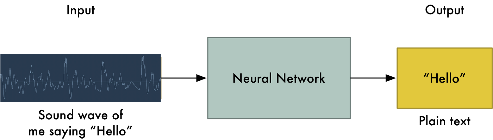

<div align="center" id="top"> 
  

  &#xa0;

  <!-- <a href="https://audioapp.netlify.app">Demo</a> -->
</div>

<h1 align="center">Speech Recognition System</h1>

<p align="center">
  

  

  

  

  <!--  -->

  <!--  -->

  <!--  -->
</p>

<!-- Status -->

<!-- <h4 align="center"> 
	🚧  Speech Recognition System 🚀 Under construction...  🚧
</h4> 

<hr> -->

<p align="center">
  <a href="#dart-about">About</a> &#xa0; | &#xa0; 
  <a href="#rocket-technologies">Technologies</a> &#xa0; | &#xa0;
  <a href="#white_check_mark-requirements">Requirements</a> &#xa0; | &#xa0;
  <a href="#checkered_flag-starting">Starting</a> &#xa0; | &#xa0;
  <a href="#memo-license">License</a> &#xa0; | &#xa0;
  <a href="https://github.com/{{YOUR_GITHUB_USERNAME}}" target="_blank">Author</a>
</p>

<br>

## :dart: About ##

Over the last few years, Voice Assistants have become ubiquitous with the popularity of Google Home, Amazon Echo, Siri, Cortana, and others.

These are the most well-known examples of Automatic Speech Recognition (ASR). This class of applications starts with a clip of spoken audio in some language and extracts the words that were spoken, as text. For this reason, they are also known as Speech-to-Text algorithms.

Of course, applications like Siri and the others mentioned above, go further. Not only do they extract the text but they also interpret and understand the semantic meaning of what was spoken, so that they can respond with answers, or take actions based on the user's commands.


## :rocket: Technologies ##

The following tools were used in this project:

- [Docker](https://www.docker.com/)
- [Tensorflow](https://www.tensorflow.org/)
- [Python](https://www.python.org/)
- [Flask](https://flask.palletsprojects.com/en/2.0.x/)
- [uWSGI](https://uwsgi-docs.readthedocs.io/en/latest/)
- [nginx](https://www.nginx.com/)
- [AWS](https://aws.amazon.com/)
- [Git](https://git-scm.com)

## :white_check_mark: Requirements ##

Before starting :checkered_flag:, you need to have [Git](https://git-scm.com), [Docker](https://www.docker.com/) and [Python](https://www.python.org/) installed. 

## :checkered_flag: Starting ##

```bash
# Clone this project
$ git clone https://github.com/{{YOUR_GITHUB_USERNAME}}/audio-app

# Access
$ cd audio-app

# just to train
$ python main.py --do_train
# just to predict
$ python main.py --do_predict\
# Todo both train and predict 
$ python main.py --do_train --do_predict

# For docker 
$ docker compose build
$ docker compose up

# The server will initialize in the <http://localhost:3000>
```

## :memo: License ##

This project is under license from MIT. For more details, see the [LICENSE](LICENSE) file.


Made with :heart: by <a href="https://github.com/human-ai2025" target="_blank">Tarini Tanaya Mohapatra</a>


1. [image credits](https://www.google.com/url?sa=i&url=https%3A%2F%2Fmedium.com%2F%40ageitgey%2Fmachine-learning-is-fun-part-6-how-to-do-speech-recognition-with-deep-learning-28293c162f7a&psig=AOvVaw09RpyS10gCZyKO9JAoXWTF&ust=1636040269198000&source=images&cd=vfe&ved=0CAwQjhxqFwoTCOChjILD_PMCFQAAAAAdAAAAABAD)
&#xa0;

<a href="#top">Back to top</a>
